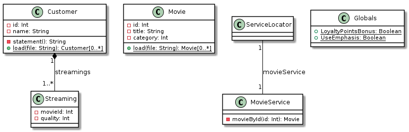

# Final test

This repository contains a code for the final test.

**Please, make sure, that you have read all the instruction on this page and you understand them.
Please ask if anything is not clear.**

## Context

The *sflix* company is an online movie streaming service similar to Netflix.
The code in this repo is responsible for statement generation, i.e. bills for customers that use sflix.
The input consists of two XML files:
- a movie database
- a streaming report, that is a list of customers with the movies they have watched in the last billing period (for simplicity, we exclude any dates).

The statement is in a plain text that represents the body of an email to be sent out to each customer (we only worry about the text, not the sending).
It contains information about what a customer has watched, how much does he own and how many loyalty points did he earned.

## Example

Given the movie database XML file:

```xml
<?xml version="1.0"?>
<movies>
    <!-- Categories can be one of the following: -->
    <!-- 1 - Normal movie -->
    <!-- 2 - New Release -->
    <!-- 3 - Kids movie -->
    <movie id="1" category="2">
        <title>Irishman</title>
    </movie>
    <movie id="2" category="1">
        <title>Taxi Driver</title>
    </movie>
    <movie id="3" category="3">
        <title>The Nightmare Before Christmas</title>
    </movie>
</movies>
```  

and a streaming report XML file:
```xml
<?xml version="1.0"?>
<customers>
    <customer id="2" name="John Doe">
        <streamings>
            <!-- Quality can be one of the following: -->
            <!-- 1 - standard definition (SD) -->
            <!-- 2 - high definition (HD) -->
            <!-- 3 - 4K resolution (4K) -->
            <streaming movie="1" quality="1" />
            <streaming movie="1" quality="2" />
            <streaming movie="2" quality="3" />
        </streamings>
    </customer>
</customers>
```  

The textual statement should be

```text
Streaming report for *John Doe* (2)
- Irishman 3.0 CZK
- Irishman (HD) 4.5 CZK
- Taxi Driver (4K) 3.0 CZK

Streamings: 3
Movies: 2
Total: *10.5* CZK
Points: 6
```

This text is produced by the [Customer.statement()](https://github.com/FIT-BI-OOP-191/ft1/blob/master/src/main/scala/sflix/Customer.scala#L48) method.

## Class diagram of the existing code

The code is split into just a few classes whose UML class digram is shown bellow.



Most of the code is in the `Customer` class.

## Your job

The code (except one bug, cf. 1 bellow) works.
However, the company has the following new requirements:

1. Make it possible to use other input than XML (i.e. JSON)
1. Make it possible to generate HTML report (and possibly other formats)
 
The company also plans to have many more movie categories and include TV series as well which will have different pricing policies.
The current code makes all of this difficult.

### Tasks

There are a number of TODO items in the code which shall guide you for the refactoring.

Start by the following:

1. Import the project into IntelliJ (or you favorite Scala editor)
1. Run the tests
1. Start by fixing the broken tests. This way you will get familiar with the code.

Once you are done with the bug fix, look at the list of TODO items in the code (In menu: `View -> Tool Windows -> TODO`).

#### HTML Report

The report should by a simple HTML page:

  ```text
  <html>
  <body>
  <h1>Streaming report for John Doe (2)</h1>
  <ul>
  <li>Irishman 3.0 CZK</li>
  <li>Irishman (HD) 4.5 CZK</li>
  <li>Taxi Driver (4K) 3.0 CZK</li>
  </ul>
  <br/>
  Streamings: 3<br/>
  Movies: 2<br/>
  Total: <b>10.5</b> CZK<br/>
  Points: 6
  </body>
  </html>
```

It should have an option to output the final price in bold (the one above has that).

## General rules

**READ THESE RULES VERY CAREFULLY**

- **KISS** - keep it simple, stupid - most of the refactoring lies in simplifying the code, reducing its complexity.
- **DRY** - do not repeat yourself - code duplication will be penalized.
- You can modify any code.
- You should not modify the input XML files.
- It is perfectly OK to use regular exceptions for error handling.
- **Refactor in small pieces, run tests after each refactoring and on commit on green tests. This way you will always have something working to hand in.**
- **If you have any doubt, please ASK!!!**

## Grading

Solving each TODO will earn you some points.
The number of points is only indicative.
The final number will be judged by a human reviewer.
It is possible to get less points if the refactoring is not well executed.
In some cases, it is also possible to get more points for an exceptionally well done refactoring.

Do the following unless you want to loose points:

- Remove unnecessary mutable state.
- Use [string interpolation](https://docs.scala-lang.org/overviews/core/string-interpolation.html) or [StringBuilder](https://docs.oracle.com/javase/8/docs/api/java/lang/StringBuilder.html) instead of string concatenation (via `+` method).
- Remove code duplication.